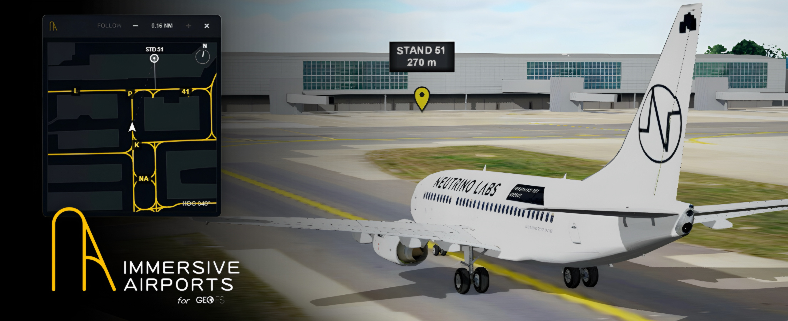

  

  

  <strong>Airport ground operations, made smart.</strong>

  <a href="https://sites.google.com/view/immersive-airports/takeoff">Website</a>
  ·
  <a href="https://github.com/neutrino-labs-studio/immersive-airports/raw/refs/heads/main/immersive-airports.user.js">Install</a>
  ·
  <a href="#installation">Installation guide</a>

---

## About

Immersive Airports is the addon designed to completely revamp ground operations in GeoFS with dynamic airport overlays, automatic airport awareness, moving maps, stand guidance and animated marshalling.

## Features

- Dynamic taxiway and airport ground overlays
- Live moving map with aircraft tracking
- Automatic airport detection and loading
- Taxiway and runway awareness notifications
- Stand selection and visual guidance
- Automatic animated marshaller display with directional instructions
- Automatic departure cleanup and arrival preparation

## Installation

### 1. Install Tampermonkey

Install the Tampermonkey browser extension if you do not already have it.

### 2. Install Immersive Airports

Click the button below:

  

Tampermonkey will open its installation screen. Confirm the installation when prompted.

### 3. Launch GeoFS

Open GeoFS normally. Immersive Airports will load automatically when the simulator is ready.

## Short Manual

### Main controls

| Button | Function |
|---|---|
| **TWY** | Opens the airport controls and loading status. When airborne, this becomes **ARR** for selecting your arrival airport. |
| **NOTIF** | Turns taxiway, runway and speed notifications on or off. |
| **STD** | Opens the stand locator, marshaller and stopping-position calibration controls. |
| **MAP** | Opens or closes the live airport moving map. |

### Airport controls

| Control | Function |
|---|---|
| **Taxiway labels** | Shows or hides taxiway names. |
| **Stand lead-in lines** | Shows or hides parking guidance lines. |
| **Stand numbers** | Shows or hides stand labels. |
| **Auto-load airports** | Automatically loads the airport around your aircraft. |
| **Load / Refresh airport** | Manually loads or refreshes the current airport. |
| **Reset** | Clears the currently loaded airport. |
| **Modify ARR** | Releases the selected arrival so you can choose another one. Press twice to confirm. |

### Stand controls

| Control | Function |
|---|---|
| **FIND** | Selects the stand entered in the search box. |
| **Marshaller guidance** | Enables or disables the animated marshaller. |
| **STOP OFFSET − / +** | Adjusts where the aircraft should stop relative to the stand point. |
| **CLEAR LOCATOR** | Removes the selected stand and its guidance. |

### Moving map controls

| Control | Function |
|---|---|
| **LOCK** | Keeps the moving map fixed at the position you selected. |
| **− / +** | Zooms the moving map out or in. |
| **×** | Closes the moving map. |

## Compatibility
### Recommended

- The latest version of Google Chrome or Microsoft Edge
- A computer capable of running GeoFS smoothly with hardware acceleration
- A stable internet connection for downloading airport geographic data
- Close unnecessary browser tabs when loading particularly large airports

Performance and loading time depend on the size of the airport, the amount of available geographic data and the response time of the public data servers.

Airport detail and feature availability depend on the geographic data available for each location.

## Recommended companion addon

For an even more immersive airport experience, pair Immersive Airports with the [Taxiway Lights addon](https://github.com/tylerbmusic/GeoFS-Taxiway-Lights/blob/main/userscript.js).

## Updates

Updates are delivered through the same userscript installation. When a new version is published, Tampermonkey can detect and install it. After installation, it's our job to send you the new versions.

## Support

For product information and guidance, visit the [Immersive Airports website](https://sites.google.com/view/immersive-airports/takeoff).

Problems and bug reports can be submitted through the repository’s [Issues](https://github.com/neutrino-labs-studio/immersive-airports/issues) page.

## Attribution

Airport geographic data is provided by [OpenStreetMap contributors](https://www.openstreetmap.org/copyright) through public Overpass API services.

Immersive Airports is an independent project and is not affiliated with or endorsed by GeoFS.

---

  <strong>Immersive Airports</strong> 
  A Neutrino Labs project

  © 2026 Neutrino Labs. All rights reserved.

