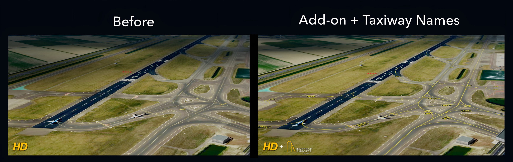

  

  

  <strong>Airport ground operations, made smart.</strong>

  <a href="https://sites.google.com/view/immersive-airports/takeoff">Website</a>
  ·
  <a href="https://github.com/neutrino-labs-studio/immersive-airports/raw/refs/heads/main/immersive-airports.user.js">Install</a>
  ·
  <a href="#installation">Installation guide</a>

---

## About

Immersive Airports is the addon designed to completely revamp ground operations in GeoFS with dynamic airport overlays, automatic airport awareness, moving maps, stand guidance and animated marshalling.

<strong>💬 Message from the team</strong>

 

Playing GeoFS for several years, we always felt like airports were one of the hardest parts of the experience to properly use.

Like many other players trying to simulate real flights, we often ended up parking somewhere that simply felt right, taxiing along routes we could barely make out, and never really knowing whether the airport we were flying to would actually be easy to navigate once we got there.

That never sat quite right with us, because it felt like the missing piece of a puzzle GeoFS had already solved almost everywhere else.

Throughout the development of Immersive Airports, we spent a lot of time flying with different beta versions, testing features, changing things, breaking things, and figuring out what actually made ground operations feel better.

And at this point, the truth is that GeoFS feels incomplete to us without it installed.

Most of the time, Immersive Airports simply sits in the background and takes care of things by itself. It knows where you are, remembers your preferences from one session to another, and gives you a much more enjoyable ground experience without constantly asking for your attention.

There is something genuinely satisfying about approaching a selected stand and suddenly seeing the marshaller come to life and guide you into position without you having to press a single button.

Coming from people who actually play GeoFS, this is the add-on we always wanted to have ourselves.

**Have fun with it, and enjoy Immersive Airports as much as we do! ˙ᵕ˙**

## Features

- Dynamic taxiway and airport ground overlays
- Live moving map with aircraft tracking
- Automatic airport detection and loading
- Taxiway and runway awareness notifications
- Stand selection and visual guidance
- Automatic animated marshaller display with directional instructions
- Automatic departure cleanup and arrival preparation

## Installation

### 1. Install Tampermonkey

Install the Tampermonkey browser extension if you do not already have it.

### 2. Install Immersive Airports

Click the button below:

  

Tampermonkey will open its installation screen. Confirm the installation when prompted.

### 3. Launch GeoFS

Open GeoFS normally. Immersive Airports will load automatically when the simulator is ready.

## Short Manual

### Main controls

| Button | Function |
|---|---|
| **TWY** | Opens the airport controls and loading status. When airborne, this becomes **ARR** for selecting your arrival airport. |
| **NOTIF** | Turns taxiway, runway and speed notifications on or off. |
| **STD** | Opens the stand locator, marshaller and stopping-position calibration controls. |
| **MAP** | Opens or closes the live airport moving map. |

### Airport controls

| Control | Function |
|---|---|
| **Taxiway labels** | Shows or hides taxiway names. |
| **Stand lead-in lines** | Shows or hides parking guidance lines. |
| **Stand numbers** | Shows or hides stand labels. |
| **Auto-load airports** | Automatically loads the airport around your aircraft. |
| **Load / Refresh airport** | Manually loads or refreshes the current airport. |
| **Reset** | Clears the currently loaded airport. |
| **Modify ARR** | Releases the selected arrival so you can choose another one. Press twice to confirm. |

### Stand controls

| Control | Function |
|---|---|
| **FIND** | Selects the stand entered in the search box. |
| **Marshaller guidance** | Enables or disables the animated marshaller. |
| **STOP OFFSET − / +** | Adjusts where the aircraft should stop relative to the stand point. |
| **CLEAR LOCATOR** | Removes the selected stand and its guidance. |

### Moving map controls

| Control | Function |
|---|---|
| **LOCK** | Keeps the moving map fixed at the position you selected. |
| **− / +** | Zooms the moving map out or in. |
| **×** | Closes the moving map. |

## How it works

Immersive Airports continuously responds to the aircraft, flight phase and surrounding airport environment. It's made to combine intelligent airport detection, chunked geographic-data loading, local caching and live ground guidance into one integrated system.

<strong>The fancy tech behind Immersive Airports</strong>

### It knows its airports

The addon monitors the aircraft’s position and automatically identifies the active airport. It manages departure cleanup, arrival preparation and destination selection as the flight progresses. 

### Smart data loading

Airport geometry is retrieved from OpenStreetMap through multiple public Overpass API services. Large airports are divided into manageable geographic chunks and loaded progressively.

Our system includes:

- Multiple-server failover
- Controlled concurrent requests
- Request spacing and timeout handling
- Automatic retries
- Duplicate-request prevention
- Coalesced rendering updates

### It also remembers airports (local airport cache)

Downloaded airport data is stored locally in the browser. Returning to a previously visited airport can therefore take only seconds while reducing unnecessary requests to public data services.

### Dynamic ground environment

Airport data is converted into an interactive environment containing taxiway overlays, labels, stand positions, lead-in guidance, awareness zones and moving-map geometry.

### Live flight integration

The system continuously synchronizes with the aircraft to provide moving-map tracking, taxiway and runway notifications, departure cleanup, arrival preparation and stand-distance calculations.

### Stand guidance and marshalling

After selecting a stand, Immersive Airports calculates the aircraft’s position relative to the parking point and lead-in direction. Guidance transitions into dynamic marshalling instructions as the aircraft approaches.

  

## Compatibility
### Recommended

- The latest version of Google Chrome or Microsoft Edge
- A computer capable of running GeoFS smoothly with hardware acceleration
- A stable internet connection for downloading airport geographic data
- Close unnecessary browser tabs when loading particularly large airports

Performance and loading time depend on the size of the airport, the amount of available geographic data and the response time of the public data servers.

Airport detail and feature availability depend on the geographic data available for each location.

### Recommended companion addon

For an even more immersive airport experience, pair Immersive Airports with the [Taxiway Lights addon](https://github.com/tylerbmusic/GeoFS-Taxiway-Lights/blob/main/userscript.js).

## Updates

Updates are delivered through the same userscript installation. When a new version is published, Tampermonkey can detect and install it. After installation, it's our job to send you the new versions.

## Support

For product information and guidance, visit the [Immersive Airports website](https://sites.google.com/view/immersive-airports/takeoff).

Problems and bug reports can be submitted through the repository’s [Issues](https://github.com/neutrino-labs-studio/immersive-airports/issues) page.

### Data accuracy

Immersive Airports generates airport overlays using OpenStreetMap (OSM) data. If taxiways, stands or markings do not align perfectly with the airport shown in GeoFS, this is usually caused by differences between the OSM data and GeoFS scenery, not by the addon itself.

Overlay accuracy therefore depends on the quality and currency of the available OSM data for each airport.

## Attribution

Airport geographic data is provided by [OpenStreetMap contributors](https://www.openstreetmap.org/copyright) through public Overpass API services.

Immersive Airports is an independent project and is not affiliated with or endorsed by GeoFS.

---

  <strong>Immersive Airports</strong> 
  A Neutrino Labs project

  © 2026 Neutrino Labs. All rights reserved.

